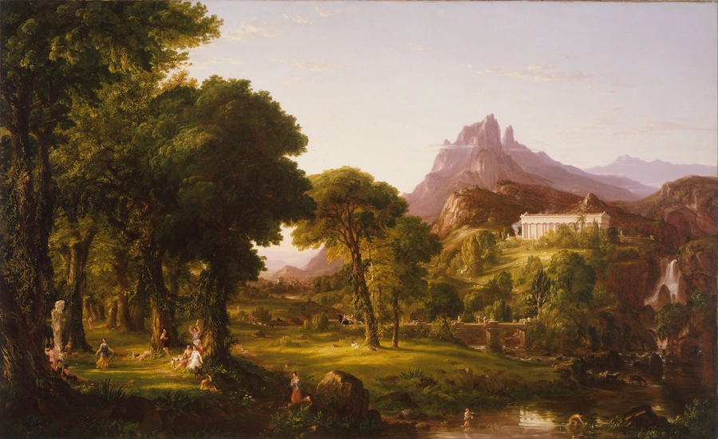
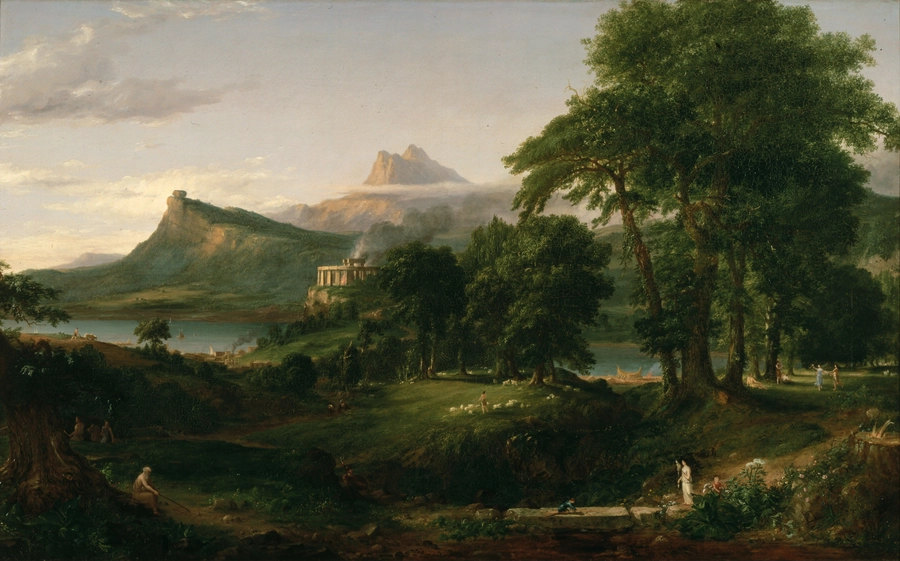

# Arcadia

> a tranquil, beautifully ordered realm where sunlight filters through tall trees and ideas grow as freely as wildflowers.

## Requirements

- [go](https://go.dev)

## Layout

- [examples](examples): Various examples.
- [exp](exp): Experimental commands. Unstable, may change at any time.

